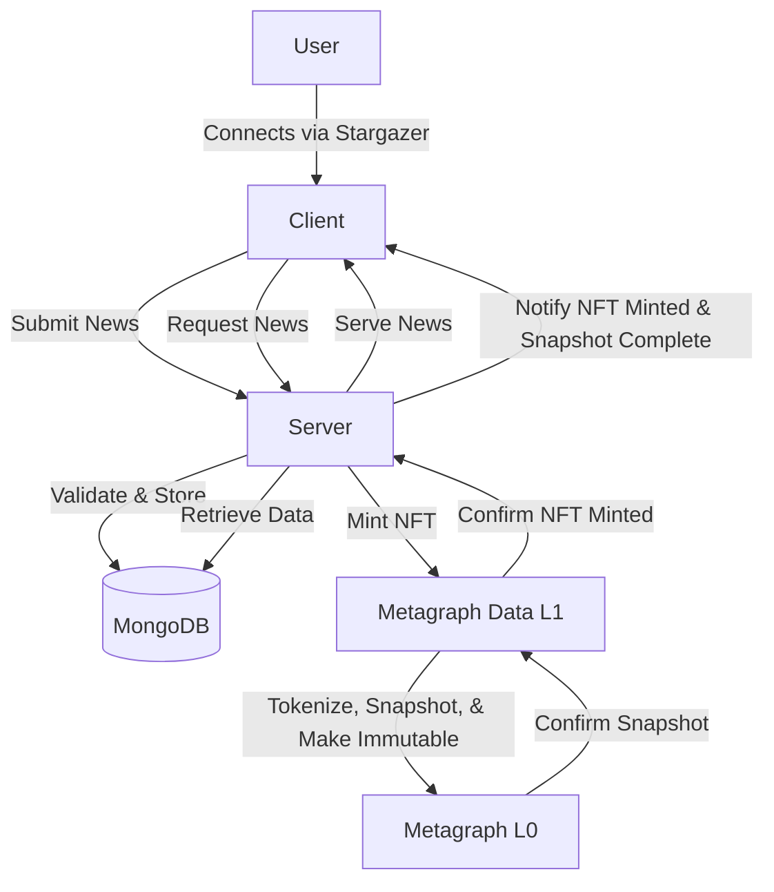
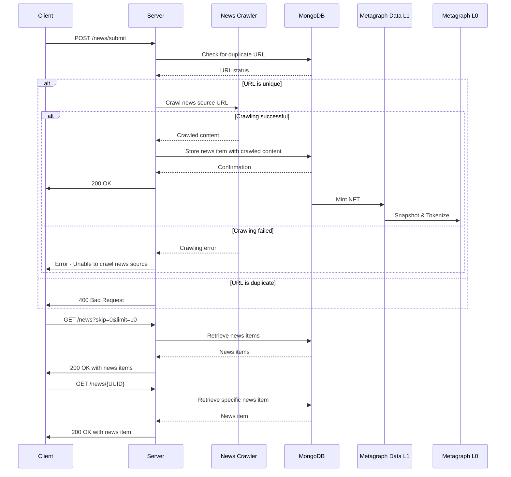

# Architecture 

## General Data Flow Diagram

```mermaid
flowchart TD
    U[User] -->|Connects via Stargazer| A[Client]
    A -->|Submit News| B[Server]
    B -->|Validate & Store| C[(MongoDB)]
    B -->|Mint NFT| D[Metagraph Data L1]
    D -->|Tokenize, Snapshot, & Make Immutable| E[Metagraph L0]
    A -->|Request News| B
    B -->|Retrieve Data| C
    B -->|Serve News| A
    D -->|Confirm NFT Minted| B
    E -->|Confirm Snapshot| D
    B -->|Notify NFT Minted & Snapshot Complete| A
```
## News Specific Data Flow Diagram

```mermaid
sequenceDiagram
    participant C as Client
    participant S as Server
    participant NC as News Crawler
    participant M as MongoDB
    participant CMD1 as Metagraph Data L1
    participant CMD0 as Metagraph L0

    C->>S: POST /news/submit
    S->>M: Check for duplicate URL
    M-->>S: URL status
    alt URL is unique
        S->>NC: Crawl news source URL
        alt Crawling successful
            NC-->>S: Crawled content
            S->>M: Store news item with crawled content
            M-->>S: Confirmation
            S->>C: 200 OK
            M->>CMD1: Mint NFT
            CMD1->>CMD0: Snapshot & Tokenize
        else Crawling failed
            NC-->>S: Crawling error
            S->>C: Error - Unable to crawl news source
        end
    else URL is duplicate
        S->>C: 400 Bad Request
    end

    C->>S: GET /news?skip=0&limit=10
    S->>M: Retrieve news items
    M-->>S: News items
    S->>C: 200 OK with news items

    C->>S: GET /news/{UUID}
    S->>M: Retrieve specific news item
    M-->>S: News item
    S->>C: 200 OK with news item
```